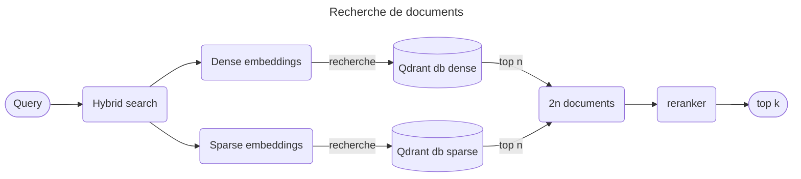

# Médée models

Ce repo contient tous les fichiers utilisés pour créer les modèles de Médée.
Nous utilisons QDRANT comme base de données vectorielles.

## Sparse embeddings
### Infos générales sur Médée-SPLADE
* C'est un modèle de `learned sparse embeddings` constuit sur **BERT**
* C'est un modèle pas seulement basé sur les mots clés du contexte, il est sémantique : la vectorisation d'un chunk peut amener des tokens non présents dans ce chunk
* Il utilise du MLM (Masked Learning Modeling) sur chaque tokens pour ensuite déduire les tokens les plus probables pour représenter tout le contexte (pooling)
* N'est pas L2R ou R2L mais prend tout le contexte one shot
* Les étapes sont les suivantes :
  * **Tokenization** : (start: `[CLS]` & end: `[SEP]`)
  * **Embedding** : (similar to Word2Vec)
  * **Encoders** : Les vecteurs traversent des couches d'encodeurs qui affinent itérativement la représentation de chaque tokens en fonction du contexte fourni par tous les autres tokens de la séquence
  * **Output** : le dernier layer renvoie une sequence d'embeddings; la représentation du token `[CLS]` est une représentation de l'input entier. Les autres embeddings sont utilisés pour reffiners les embeddings ou en faire des moyennes (pooling) -> dense vectors

## Dense embeddings

## Reranker
